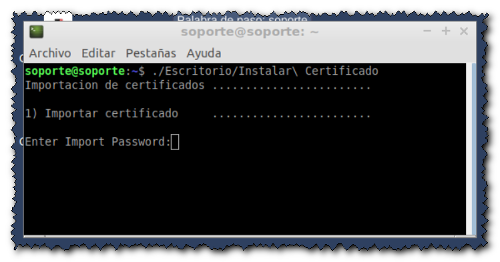

# vpnrdp
LiveCD para realizar conexiones seguras sobre redes públicas mediante VPN (Fortigate) a escritorios corporativos remotos utilizando el protocolo RDP.
(OpenSource para ayudar a los departamentos de IT en la crisis del COVID-19)

## Versiones

   `Recomendación: Utilizar la versión de 32bits y si no funciona correctamente utilizar la versión de 64bits`

### 32bits (Lubuntu 16.04.3 i386 - Válido para todos los equipos)

#### Versión v00r02-6 i386 - 29/03/2020

- [**vpnrdp_v00r02-6_i386.iso**](https://drive.google.com/file/d/1exb0jNwevglBLeoX6skN3FipiWYFUW7S/view?usp=sharing) (29/03/2020) LiveCD vpnrdp versión v00r02-6 i386 
- [**vpnrdp_v00r02-6_i386.iso.hexhash**](https://github.com/digitaliza-aapp/vpnrdp/blob/master/vpnrdp_v00r02-6_i386.iso.hexhash?raw=yes) (29/03/2020) Huella Digital versión v00r02-6 i386  

 `Versión v00r02-6 i386: Añadir herramientas para clonado y generación de USBs con persistencia`
 
#### Versión v00r02-3 i386 - 27/03/2020

- [**vpnrdp_v00r02-3_i386.iso**](https://drive.google.com/file/d/1TyIt6fGtcpXcdhK3ixamQJc-uYBFD57C/view?usp=sharing) (27/03/2020) LiveCD vpnrdp versión v00r02-3 i386 
- [**vpnrdp_v00r02-3_i386.iso.hexhash**](https://github.com/digitaliza-aapp/vpnrdp/blob/master/vpnrdp_v00r02-3_i386.iso.hexhash?raw=yes) (27/03/2020) Huella Digital versión v00r02-3 i386

 `Versión v00r02-3 i386: Lubuntu 16.04.3 LTS (xenial), openfortigui, remmina`
 
### 64bits (Lubuntu 18.04.4 amd64 - Sólo arquitecturas de 64bits)

#### Versión v00r02-6 amd64 - 29/03/2020

- [**vpnrdp_v00r02-6_amd64.iso**](https://drive.google.com/file/d/12cgE48wigek6FlLeAirsdYNDQVIDn90O/view?usp=sharing) (29/03/2020) LiveCD vpnrdp versión v00r02-6 amd64 
- [**vpnrdp_v00r02-6_amd64.iso.hexhash**](https://github.com/digitaliza-aapp/vpnrdp/blob/master/vpnrdp_v00r02-6_amd64.iso.hexhash?raw=yes) (29/03/2020) Huella Digital versión v00r02-6 amd64

 `Versión v00r02-6 i386: Añadir herramientas para clonado y generación de USBs con persistencia`
 
#### Versión v00r01-4 amd64 - 25/03/2020

- [**vpnrdp_v00r01-4.iso**](https://drive.google.com/file/d/1z0506MWcTTR3q_-n0unegmEgEsfdGXc2/view?usp=sharing) (25/03/2020) LiveCD vpnrdp versión v00r01-4
- [**vpnrdp_v00r01-4.iso.hexhash**](https://github.com/digitaliza-aapp/vpnrdp/blob/master/vpnrdp_v00r01-4.iso.hexhash?raw=yes) (25/03/2020) Huella Digital versión v00r01-4

 `Versión v00r01-4 amd64: Lubuntu 18.04.4 LTS (bionic), openfortigui, remmina`
 
## Guías

- [**Configuración (pdf)**](https://github.com/digitaliza-aapp/vpnrdp/blob/master/vpnrdp_v00r02-3.pdf?raw=yes) Guía de configuración
- [**Configuración (video)**](https://github.com/digitaliza-aapp/vpnrdp/blob/master/VPNRDP.webm?raw=yes) Vídeo de configuración

### Pasos a realizar para acceder al escritorio remoto:

 (Para una información más detallada consultar la `Guía de configuración`)
 
  1. Arrancar la imagen desde USB o DVD
  2. Conectar un USB al equipo con el certificado (p12 ó pfx), renombrarlo como `certificado.p12` y copiarlo al escritorio
  3. Ejecutar el script `Instalar Certificado` que está en el escritorio `haciendo doble clic sobre el icono`
  4. Abrir OpenFortiGUI `haciendo doble clic sobre el icono` y poner las credenciales (usuario/contraseña) y acceder a la VPN
  5. Abrir Remmina `haciendo doble clic sobre el icono` y poner las credenciales para acceder al escritorio remoto (IP,usuario,contraseña y dominio)


## Problemas

### Error 1: Ha solicitado el modo H264 GFX pero su libfreerdp no admite H264 compruebe los ajuste de profundidad de color
  ```Solución: Realizar cambios en la profundidad de color (Ejemplo: Color verdadero 24ppp)```

### Error 2: Al hacer doble clic sobre el icono `Instalar Certificado`no se solicita la palabra de paso del certificado digital

  1. Pulsar simultaneamente las teclas `Ctrl` + ` Alt` + `t` y aparecerá un terminal de comandos
  2. Teclear `./Escritorio/Instalar\ Certificado` y pulsar la tecla `Enter`
  3. Introducir la contraseña del certificado (2 veces).
  
  

## Contacto

Para hacer sugerencias ó reportar incidencias puede enviar un correo electrónico a digitaliza.aapp@gmail.com  

## Créditos

- [**LiveCD vpnrdp**](https://github.com/digitaliza-aapp/vpnrdp/blob/master/README.md) LiveCD - Conexión a escritorios mediante VPN y RDP
- [**Lubuntu**](https://lubuntu.net/)	Distribución Linux ligera basada en Ubuntu
- [**OpenFortiGUI**](https://github.com/theinvisible/openfortigui) VPN-GUI para conexiones a Fortigate basado en
openfortivpn
- [**Remmina**](https://remmina.org/)	Cliente de escritorio remoto
- [**SystemBack**](https://sourceforge.net/projects/systemback/) Simple system backup and restore	

## Ausencia de garantías

El liveCd vpnrdp se provee en su estado actual y sin garantías de ningún tipo. No se ofrece de manera explícita, implicita, ni jurada garantías, afirmaciones ni declaraciones de ningún tipo con respecto al liveCd vpnrdp.

## Descargo de responsabilidad

Usted recibe el liveCd vpnrdp de forma gratuita, por consiguiente, usted reconoce y acepta que el personal que ha participado en el proyecto no tendrá responsabilidad alguna que surja del uso del liveCd o se relacione con dicho uso. Su único derecho o recurso legal ante cualquier problema o disconformidad con el liveCd vpnrdp es dejar de usarlo de inmediato. 
