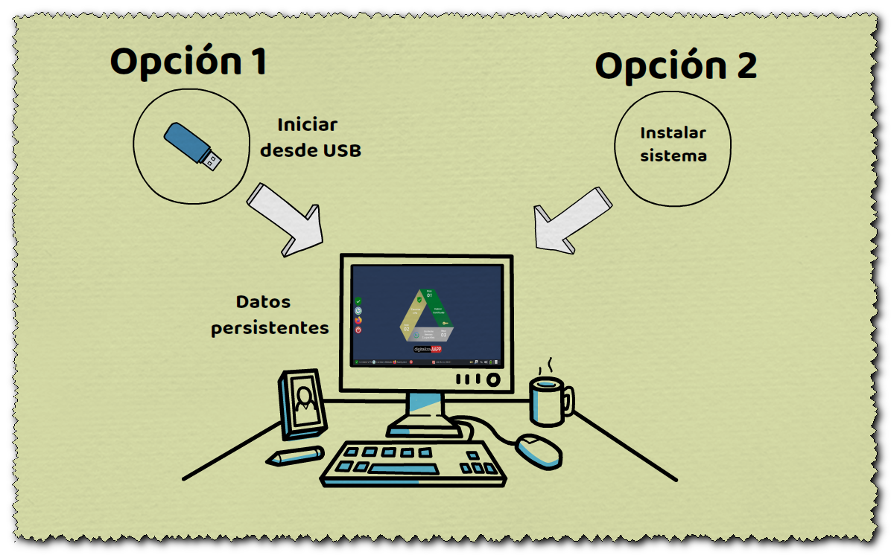
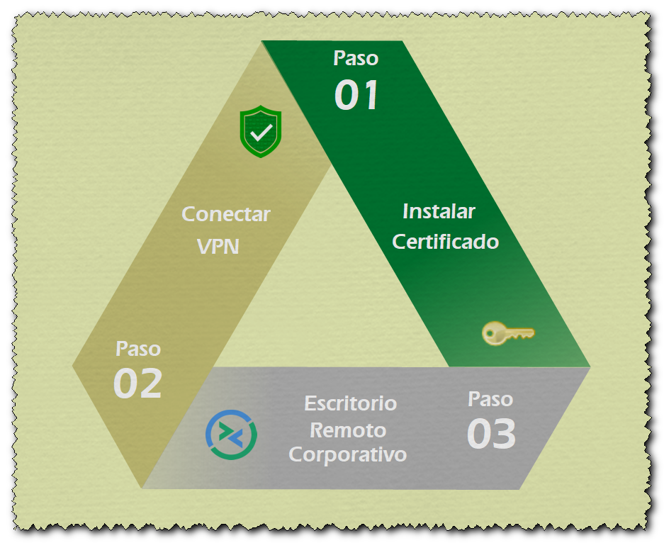

# vpnrdp
LiveCD para realizar conexiones seguras sobre redes públicas mediante VPN a escritorios corporativos remotos utilizando el protocolo RDP.
(OpenSource para ayudar a los departamentos de IT en la crisis del COVID-19)

[**Presentación del proyecto**](https://github.com/digitaliza-aapp/vpnrdp/blob/master/Vpnrdp%20Digitalizaaapp%20V00r01-18.webm?raw=yes) Vídeo de presentación

## Opciones de funcionamiento

  
 
## Configuración

- [**Guía de configuración (pdf)**](https://github.com/digitaliza-aapp/vpnrdp/blob/master/vpnrdp_kiosk_v00r03.pdf?raw=yes) Guía de configuración

## Imagen persistente (Opción recomendada)

Imagen preparada para trabajar en modo persistente (no es necesario instalar el certificado en cada arranque del sistema), permite arranque dual MBR (Legacy BIOS) / UEFI y crea una partición para poder almacenar el certificado digital (pfx ó p12 ) facilitando su instalación

- [**v02r10.2x_kiosk_amd64_1.img**](https://drive.google.com/file/d/1N2pjgIZg6WLGV0Qh8NyK916ZgBA3xZuN/view?usp=sharing) (23/01/2021) Imagen vpnrdp_kiosk versión v02r10.2x (amd64 64bits) 
- [**v02r10.2x_kiosk_amd64_1.img.hexhash**](https://drive.google.com/file/d/1U9rYLG4FnuakjwKDPRBN-Ls-4wlL8Tdw/view?usp=sharing) (23/01/2021) Huella Digital imagen vpnrdp_kiosk versión v02r10.2x


Nota:  Para copiar la imagen a un pendrive puede utilizar programas como Rufus (https://rufus.ie/)

Si el sistema no arranca en equipos con el ```firmware UEFI``` puede ser debido a que está activada la opción **Secure Boot** en la UEFI.

## Descarga ISO

Imagen ISO

- [**vpnrdp_kiosk_v02r10.2x.iso**](https://drive.google.com/file/d/10IbgQXiadbvc7Gap9S6s8ZKifd_lgmIW/view?usp=sharing) (23/01/2021) LiveCD vpnrdp_kiosk versión v02r10.2x (amd64 64bits) 
- [**vpnrdp_kiosk_v02r10.2x.iso.hexhash**](https://drive.google.com/file/d/12GC8hZMo2Bp4ZHomXDnsxNZoy1v1aSy9/view?usp=sharing) (23/01/2021) Huella Digital versión v02r10.2x

## Pasos a realizar para acceder al escritorio remoto:

 (Para una información más detallada consultar la `Guía de configuración`)
 
  
    
  1. Arrancar la imagen desde USB o DVD
  2. Conectar un USB al equipo con el certificado (p12 ó pfx)
  3. Ejecutar el script para instalar el certificado `haciendo doble clic sobre el icono`
  4. Abrir OpenFortiGUI `haciendo doble clic sobre el icono` y poner las credenciales (usuario/contraseña) y acceder a la VPN
  5. Abrir Remmina `haciendo doble clic sobre el icono` y poner las credenciales para acceder al escritorio remoto (IP,usuario,contraseña y dominio)
  
## Contacto

Para hacer sugerencias ó reportar incidencias puede enviar un correo electrónico a digitaliza.aapp@gmail.com  

## Créditos

El LiveCD vpnrdp utiliza componentes Open Source. A continuación puede encontrar un enlace a los proyectos. Reconocemos y agradecemos a los desarrolladores su contribución al código abierto.

This application uses Open Source components. You can find a link to their projects, we acknowledge and are grateful to these developers for their contributions to open source.

- [**LiveCD vpnrdp**](https://github.com/digitaliza-aapp/vpnrdp/blob/master/README.md) LiveCD - Conexión a escritorios mediante VPN y RDP
- [**Xubuntu**](https://xubuntu.org/)	Distribución Linux ligera basada en Ubuntu + Escritorio ligero XFCE
- [**OpenFortiGUI**](https://github.com/theinvisible/openfortigui) VPN-GUI para conexiones a Fortigate basado en
openfortivpn
- [**Remmina**](https://remmina.org/)	Cliente de escritorio remoto
- [**Firefox**](http://mozilla.org) Navegador Web
- [**FreeRDP**](https://github.com/FreeRDP/FreeRDP) Implementación protocolo RDP
- [**XFreeRDP-GUI**](https://github.com/wyllianbs/xfreerdp-gui) Entorno gráfico para FreeRDP
- [**Clamav**](https://www.clamav.net/downloads) Antivirus Open Source
- [**Docky**](https://launchpad.net/docky) Lanzador de aplicaciones
- [**Mkusb**](https://launchpad.net/~mkusb/+archive/ubuntu/ppa) Herramienta para crear unidades de arranque USB
- [**SystemBack**](https://sourceforge.net/projects/systemback/) Simple system backup and restore

## Ausencia de garantías
EL LIVECD VPNRDP SE PROVEE EN SU ESTADO ACTUAL Y SIN GARANTÍAS DE NINGÚN TIPO. NO SE OFRECE DE MANERA EXPLÍCITA, IMPLÍCITA, NI JURADA GARANTÍAS, AFIRMACIONES NI DECLARACIONES DE NINGÚN TIPO CON RESPECTO AL LIVECD VPNRDP

## Descargo de responsabilidad
Usted recibe el LIVECD VPNRDP de forma gratuita. POR CONSIGUIENTE, USTED RECONOCE Y ACEPTA QUE EL PERSONAL QUE HA PARTICIPADO EN EL PROYECTO NO TENDRÁ RESPONSABILIDAD ALGUNA QUE SURJA DEL USO DEL LIVECD O SE RELACIONE CON DICHO USO. SU ÚNICO DERECHO O RECURSO LEGAL ANTE CUALQUIER PROBLEMA O DISCONFORMIDAD CON EL LIVECD VPNRDP ES DEJAR DE USARLO DE INMEDIATO. 

## Disclaiming warranty
LIVECD VPNRDP IS PROVIDED IN ITS CURRENT STATUS AND WITHOUT WARRANTIES OF ANY KIND. NO WARRANTIES, CLAIMS, OR STATEMENTS OF ANY KIND WITH REGARD TO
THE LIVECD VPNRDP ARE PROVIDED EXPLICIT, IMPLIED, OR SWORN.

## Limiting liability
You receive LIVECD VPNRDP for free. ACCORDINGLY, YOU ACKNOWLEDGE AND AGREE THAT THE PERSONNEL WHO HAVE PARTICIPATED IN THE PROJECT SHALL HAVE NO LIABILITY ARISING FROM THE USE OF THE LIVECD OR RELATING TO SUCH USE. YOUR SOLE RIGHT OR LEGAL REMEDY FOR ANY PROBLEM OR DISPUTE WITH THE LIVECD VPNRDP IS TO  STOP USING IT IMMEDIATELY.
